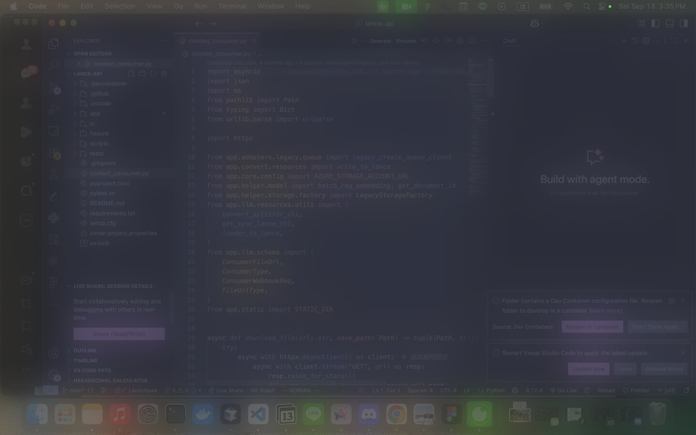

# EyeZen

EyeZen 是一款 macOS 應用程式，旨在保護您的視力。它使用設備的攝影機來估算您與螢幕之間的距離。當您靠得太近時，它會自動對螢幕應用模糊效果，提醒您保持健康的觀看距離。您可以透過菜單欄圖示輕鬆控制應用程式。

## 功能

-   即時人臉偵測與距離估算
-   當使用者距離螢幕過近時，自動應用模糊效果
-   漸進式模糊：模糊程度會根據使用者與螢幕的距離動態調整
-   透過菜單欄圖示啟用/停用模糊效果，並設定偏好的距離閾值
-   使用 Swift、AVFoundation、Vision 和 Cocoa 框架開發

## 專案結構

-   `EyeZen/`: 主要且重構後的應用程式原始碼。
-   `Icaps/`: 專案的初始概念驗證（POC）版本。
-   `Distance_Estimation.py`: 一個用於早期演算法驗證的 Python 腳本，目前的應用程式並未使用。

## 需求

-   macOS 14.3 或更新版本
-   Xcode 15.4 或更新版本
-   攝影機存取權限

## 安裝與執行

您可以透過以下兩種方式執行 EyeZen：

### 1. 從原始碼執行 (需要 Xcode)

1.  複製此儲存庫。
2.  在 Xcode 中打開 `EyeZen/EyeZen.xcodeproj`。
3.  確保您的設備已連接攝影機，並在提示時授予應用程式存取權限。
4.  點擊 Xcode 左上角的「Build and Run」按鈕 (▶️) 來啟動應用程式。

### 2. 作為獨立應用程式執行

1.  首先，請依照「從原始碼執行」的步驟在 Xcode 中打開專案。
2.  在 Xcode 頂部菜單中，選擇 `Product` > `Archive`。
3.  Archive 完成後，會彈出 Organizer 視窗。在視窗中選擇您剛剛建立的封存檔案。
4.  點擊右側的 `Distribute App` 按鈕。
5.  選擇 `Copy App` 作為分發方式，然後點擊 `Next`。
6.  選擇一個位置來儲存打包好的 `.app` 檔案。
7.  完成後，您可以直接在 Finder 中雙擊該 `.app` 檔案來執行，無需再開啟 Xcode。

## 使用方式

-   應用程式會在菜單欄中運行。
-   使用菜單來啟用或停用模糊效果。
-   使用滑桿調整您偏好的觀看距離。

## Demo

### 模糊效果範例圖片

	

### 示範影片
p.s. 建議關掉聲音 錄影時外面在施工聲音有點大
https://youtube.com/shorts/s0YXrTgxJqQ?feature=share

